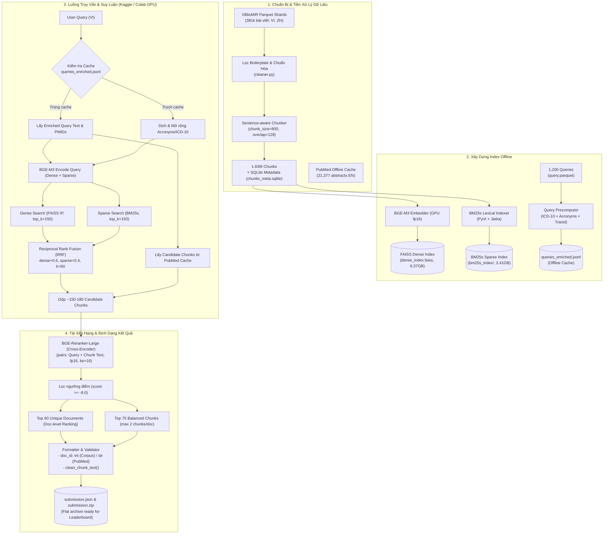

# 🏥 Kiến Trúc & Luồng Xử Lý Hệ Thống (Current Pipeline Flow)
## Road to AI 2026 (R2AI) - Multilingual Medical Document Retrieval

Tài liệu này mô tả chi tiết toàn bộ luồng hoạt động (End-to-End Flow) hiện tại của hệ thống trích xuất tài liệu và đoạn văn y khoa đa ngữ (**ViBioMIR**), từ khâu chuẩn bị dữ liệu, xây dựng index, truy vấn lai (Hybrid Retrieval), tái xếp hạng (Cross-Encoder Reranking), đến xuất file nộp bài chuẩn định dạng giải đấu.

---

## 1. Sơ Đồ Tổng Quan Luồng Xử Lý (End-to-End Architecture)



---

## 2. Chi Tiết Từng Giai Đoạn Trong Pipeline

### Giai Đoạn 1: Chuẩn Bị & Tiền Xử Lý Dữ Liệu (Data Preparation)
1. **Nguồn Dữ Liệu**:
   * **Corpus nội bộ (VI, ZH)**: Tải từ Hugging Face Bucket (`hf://buckets/nieths/ViBioMIR/corpus`), chia làm 5 shard Parquet (`corpus_part_000.parquet` đến `corpus_part_004.parquet`), tổng cộng 381,325 bài viết đã cào và làm sạch.
   * **Corpus y khoa tiếng Anh (EN)**: Tải trước 21,377 bài báo PubMed có liên quan vào `data/processed/pubmed_cache.jsonl` để suy luận hoàn toàn offline không cần gọi API mạng.
2. **Làm Sạch Văn Bản (`src/ingestion/cleaner.py`)**:
   * Xóa quảng cáo, disclaimer, số điện thoại hotline, thông tin đặt lịch khám theo bộ luật regex (`configs/boilerplate_patterns.yaml`).
   * Chuẩn hóa Unicode NFC, xóa khoảng trắng thừa.
3. **Cắt Đoạn (Chunking - `src/ingestion/chunker.py`)**:
   * Kích thước đoạn tối đa: `max_chunk_size = 800` ký tự.
   * Độ trượt gối đầu: `chunk_overlap = 128` ký tự.
   * Cắt theo ranh giới câu trọn vẹn (Sentence-aware splitting bằng PyVi cho tiếng Việt và Jieba cho tiếng Trung), tránh cắt cụt câu giữa chừng.
   * Tổng số chunk sinh ra: **1,629,691 chunks**.
   * Lưu trữ metadata (doc_id, chunk_id, chunk_text, title, lang) vào SQLite zero-copy (`chunks_meta.sqlite`).

---

### Giai Đoạn 2: Xây Dựng Index Đa Tầng (Indexing)
Hệ thống sử dụng cơ chế **Hybrid Indexing (Dày + Thưa)**:

1. **Dense Vector Index (`src/retrieval/dense_index.py`)**:
   * **Mô hình**: `BAAI/bge-m3` (1024 chiều, normalized embedding, fp16).
   * **Cấu trúc**: `faiss.IndexFlatIP` (tính Inner Product tương đương Cosine Similarity).
   * **Cơ chế tải**: Tải theo cờ bộ nhớ ánh xạ không sao chép `faiss.IO_FLAG_MMAP`, chỉ tốn ~1.3 GB RAM thay vì nạp toàn bộ 6.37 GB vào bộ nhớ chính.
2. **Sparse BM25 Index (`src/retrieval/sparse_index.py`)**:
   * **Thư viện**: `bm25s` (tối ưu hóa cao bằng C++/NumPy mmap, tốc độ gấp 500x so với `rank_bm25`).
   * **Tokenization**: Hỗ trợ đa ngữ tự nhiên (PyVi cho Tiếng Việt, Jieba cho Tiếng Trung, regex tokenizer cho Tiếng Anh).
   * **Dung lượng**: ~3.41 GB trên ổ cứng, hỗ trợ `mmap=True` khi load.
3. **Offline Query Enrichment (`scripts/precompute_queries.py`)**:
   * Tiền xử lý 1,200 câu hỏi test: mở rộng từ viết tắt y khoa (`data/lexicon/medical_acronyms.json`), mapping thuật ngữ ICD-10 Việt - Trung - Anh (`data/lexicon/medical_terms.json`), tìm sẵn candidate PMIDs từ bộ nhớ cache.
   * Xuất ra `data/processed/queries_enriched.jsonl`. Khi chạy inference, pipeline chỉ cần tra cứu O(1) từ file này.

---

### Giai Đoạn 3: Truy Vấn Lai & Tái Xếp Hạng (Hybrid Retrieval & Reranking)
Được thực thi trong `src/pipeline.py` và script suy luận nhanh `scripts/run_inference_only.py`:

```
Input Query ────────► BGE-M3 (Encode Query)
                          │
         ┌────────────────┴────────────────┐
         ▼                                 ▼
   Dense Retrieval                  Sparse Retrieval
 (FAISS, top_k=150)                (BM25s, top_k=150)
         │                                 │
         └────────────────┬────────────────┘
                          ▼
           Reciprocal Rank Fusion (RRF)
     score = 0.6 * RRF(dense) + 0.4 * RRF(sparse)
                          │
                          ▼
             Gộp thêm PubMed Offline Chunks
                          │
                          ▼
             ~150 - 180 Candidate Chunks
                          │
                          ▼
                 BGE-Reranker-Large
               (Cross-Encoder, fp16)
                          │
                          ▼
               Lọc score >= -8.0 & Sort
```

1. **Reciprocal Rank Fusion (RRF)**:
   * Điểm số:
     $$RRF\_Score(d) = w_{dense} \cdot \frac{1}{k + rank_{dense}(d)} + w_{sparse} \cdot \frac{1}{k + rank_{sparse}(d)}$$
     với $k = 60, w_{dense} = 0.6, w_{sparse} = 0.4$.
2. **Tái Xếp Hạng (Reranker - `src/reranker/bge_reranker.py`)**:
   * **Mô hình**: `BAAI/bge-reranker-large` (Cross-Encoder 560M params).
   * Chạy trên GPU với `torch_dtype = torch.float16`, batch size = 16 (chống tràn VRAM Kaggle T4 16GB).
   * Cặp input: `(Query, Chunk_Text)`.
   * Lọc bỏ các chunk có điểm relevance thấp hơn `score_threshold = -8.0`.

---

### Giai Đoạn 4: Trích Xuất & Xuất File Nộp Bài (Submission Formatting)
Thực hiện trong `src/submission/formatter.py`:

1. **Quy tắc Trích Xuất**:
   * **Tài liệu (`relevant_docs`)**: Lấy **top 60** `doc_id` duy nhất có điểm rerank cao nhất.
   * **Đoạn trích (`relevant_chunks`)**: Lấy **top 75** chunks theo thuật toán 2 lượt:
     * *Pass 1 (Diversity)*: Mỗi tài liệu chỉ lấy tối đa `max_chunks_per_doc = 2` chunks để tránh tài liệu dài độc chiếm danh sách.
     * *Pass 2 (Recall Safeguard)*: Nếu chưa đủ chỉ tiêu 75 chunks, lấy tiếp các chunk có điểm cao tiếp theo của các tài liệu trong top 60.
2. **Chuẩn Hóa Format BTC**:
   * `clean_chunk_text()`: Loại bỏ toàn bộ tiền tố phụ (`Tiêu đề: ...\nNội dung: ...`), chỉ giữ văn bản nguyên gốc của bài viết.
   * `normalize_doc_id()`:
     * Corpus ID Việt/Trung ($\le 4,420,561$): Chuyển thành kiểu số nguyên `int`.
     * PubMed PMID ($> 4,420,561$ hoặc chuỗi): Giữ kiểu chuỗi `str` hoặc `int`.
3. **Đóng Gói Nén (Flat ZIP)**:
   * Ghi file `submission.json`.
   * Đóng gói thành `submission.zip` chứa trực tiếp `submission.json` ở thư mục gốc (không chứa thư mục con).

---

## 3. Cấu Trúc Thư Mục Dự Án Liên Quan

```
med-doc-retrieval/
├── configs/
│   ├── config.yaml               # Toàn bộ tham số siêu tham số (chunk, retrieval, reranker)
│   ├── boilerplate_patterns.yaml # Tập regex làm sạch quảng cáo
│   └── pubmed_stopwords.txt      # Từ dừng cho truy vấn PubMed
├── data/
│   ├── indices/                  # Thư mục chứa index suy luận
│   │   ├── dense_index.faiss     # 6.37 GB (FAISS FlatIP)
│   │   ├── chunks_meta.sqlite    # 2.37 GB (Metadata chunks)
│   │   └── bm25s_index/          # 3.41 GB (Sparse index)
│   ├── processed/
│   │   ├── queries_enriched.jsonl# Cache enriched queries
│   │   └── pubmed_cache.jsonl    # Cache bài báo PubMed
│   └── raw/
│       └── vibio_mir/query.parquet # File query chính thức BTC
├── docs/
│   └── pipeline_flow.md          # Tài liệu luồng này
├── notebooks/
│   └── 04_kaggle_pipeline.ipynb  # Notebook thực thi trên Kaggle
├── scripts/
│   ├── run_inference_only.py     # Script suy luận nhanh chuyên biệt trên GPU
│   ├── colab_runner.py           # Script build index + infer trên Colab
│   └── precompute_queries.py     # Script offline query enrichment
└── src/
    ├── config.py                 # Pydantic Configuration Loader
    ├── crawler/                  # Module dịch query và PubMed
    ├── embedding/bge_m3.py       # Wrapper BGE-M3 (Dense + Sparse)
    ├── ingestion/                # Module làm sạch & cắt chunk
    ├── retrieval/                # FAISS, BM25s, HybridRetriever
    ├── reranker/bge_reranker.py  # Cross-Encoder Reranker
    └── submission/formatter.py   # Format & validate JSON/ZIP nộp bài
```

---

## 4. Bảng Tham Số Cấu Hình Hiện Tại (`configs/config.yaml`)

| Thành phần | Tham số | Giá trị hiện tại | Ý nghĩa |
| :--- | :--- | :--- | :--- |
| **Chunking** | `max_chunk_size` | `800` | Chiều dài ký tự tối đa của 1 chunk |
| | `chunk_overlap` | `128` | Ký tự trượt gối đầu giữa các câu |
| **Embedding** | `model_name` | `BAAI/bge-m3` | Embedding đa ngữ dày (1024 chiều) |
| | `use_fp16` | `true` | Tiết kiệm 50% VRAM GPU |
| **Retrieval** | `dense_top_k` | `350` | Số candidate dense từ FAISS (mở rộng candidate pool) |
| | `sparse_top_k` | `350` | Số candidate sparse từ BM25s (mở rộng candidate pool) |
| | `hybrid_top_k` | `350` | Số candidate sau RRF đưa vào Reranker (tăng từ 150 lên 350) |
| | `dense_weight` / `sparse_weight` | `0.6 / 0.4` | Tỉ lệ dung hợp RRF |
| **Reranker** | `model_name` | `BAAI/bge-reranker-large` | Cross-encoder độ chính xác cao |
| | `batch_size` | `16` | Batch size an toàn tránh OOM trên T4 |
| | `top_k_docs` | `70` | Số tài liệu xuất vào submission (khớp trung bình 71.0 của BTC) |
| | `top_k_chunks` | `150` | Số chunk xuất vào submission (tăng từ 75 lên 150 để đẩy mạnh Chunk Recall) |
| | `score_threshold` | `-8.0` | Ngưỡng lọc điểm relevance tối thiểu |
| | `max_chunks_per_doc` | `3` | Tối đa 3 chunk/bài cho các tài liệu có độ liên quan cao nhất |

---

## 5. Đánh Giá Hiệu Năng & Các Cải Tiến Đang Triển Khai

* **Điểm số Submission 4**:
  * $\text{DOCS\_F2} = \mathbf{0.1050}$ (Recall = 11.6%, Precision = 12.7%).
  * $\text{CHUNKS\_F2} = \mathbf{0.0122}$ (Recall = 1.38%, Precision = 1.37%).
  * $\text{FINAL\_SCORE} = \mathbf{0.0586}$.
* **Điểm nghẽn chính**: CHUNKS_F2 đang kéo tụt điểm tổng do ranh giới chunk 800 ký tự cắt lệch đoạn trả lời của BTC (91.6% chunk thuộc tài liệu đúng bị rớt do `overlap < 0.4`).
* **Hướng tối ưu tiếp theo**:
  1. Nâng `hybrid_top_k` lên $300 - 400$ để mở rộng candidate pool.
  2. Nâng `top_k_chunks` lên $120 - 150$ chunks/query để tăng độ phủ Recall cho Macro F2.
  3. Áp dụng Paragraph-Aware Chunking (cắt theo cấu trúc đoạn tự nhiên `\n\n` ~400-500 ký tự) để khớp ranh giới chấm điểm LCS token của BTC.
